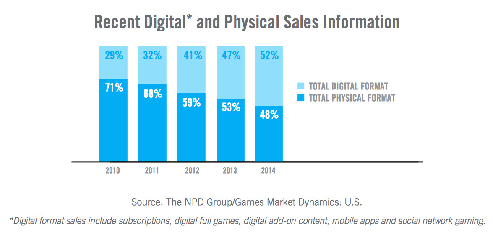
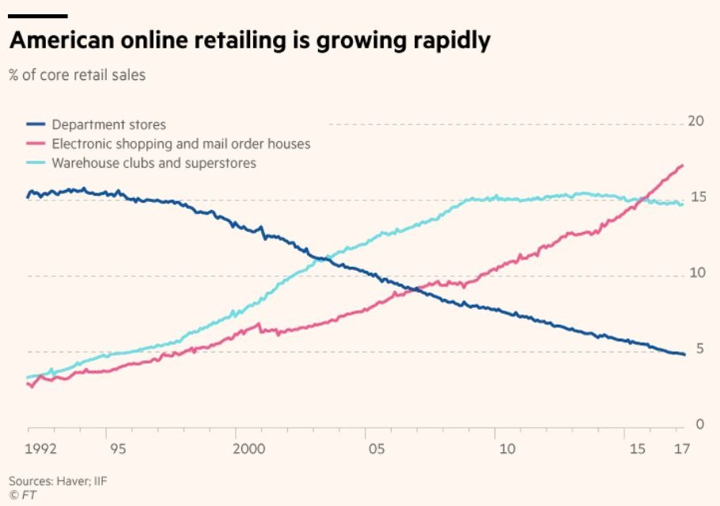
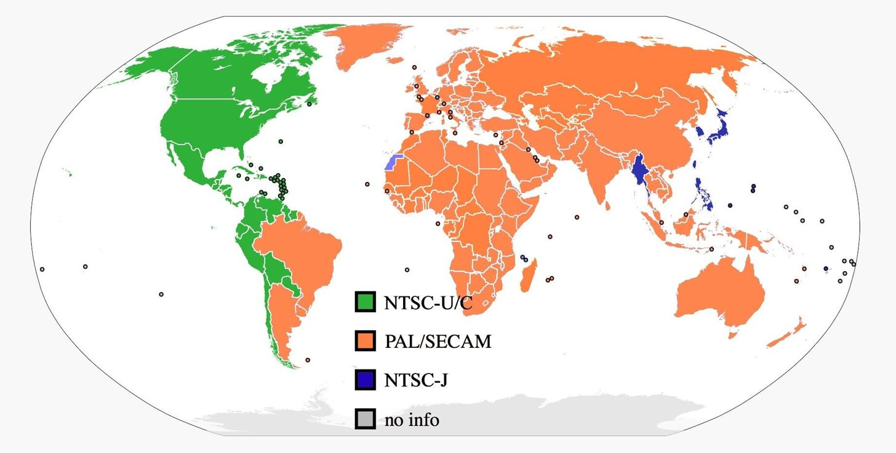
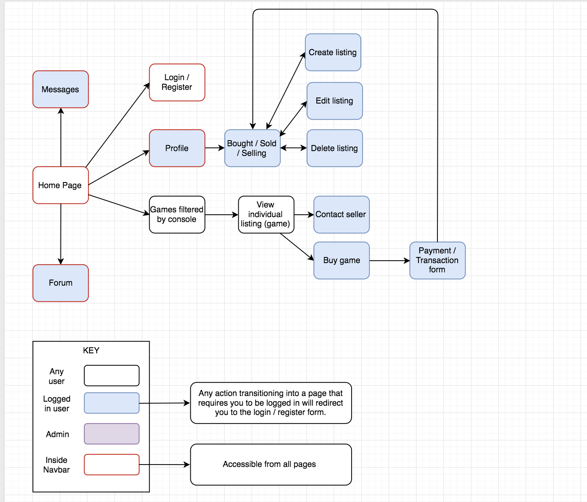
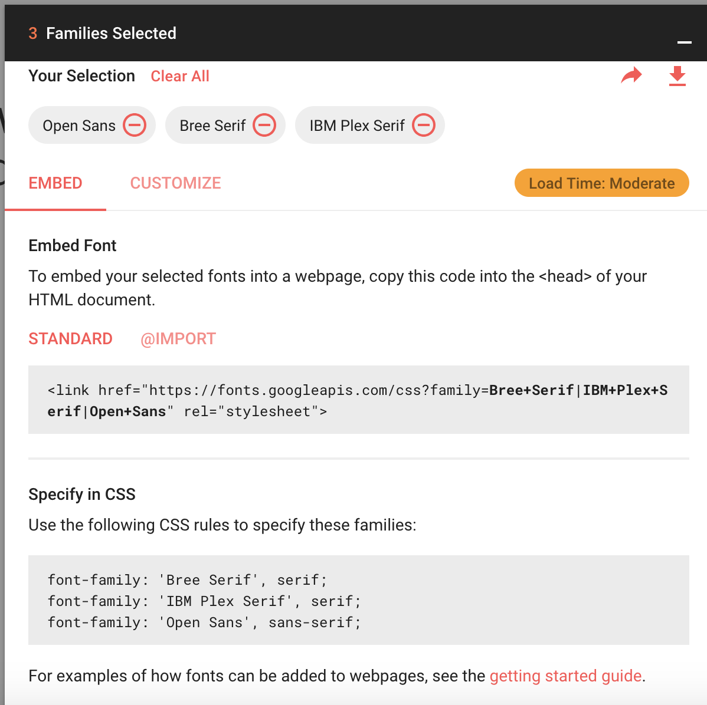
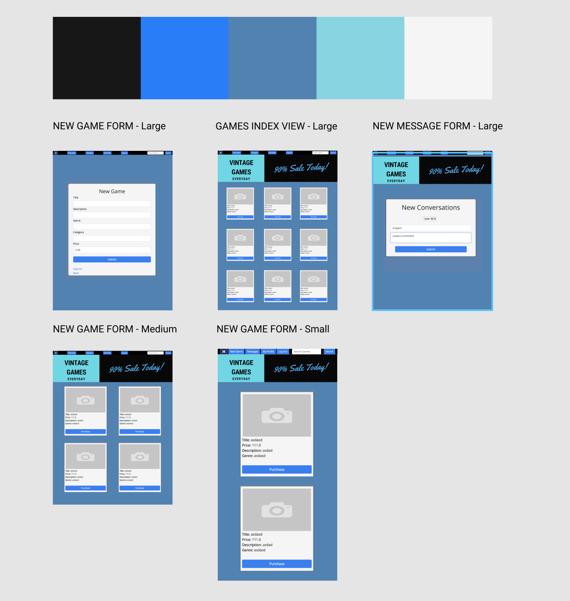
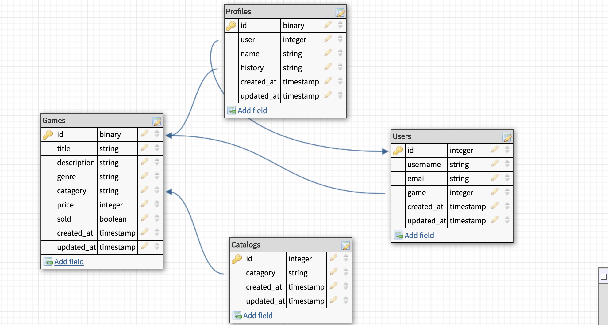
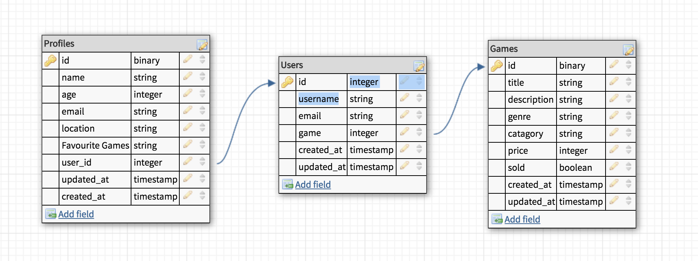
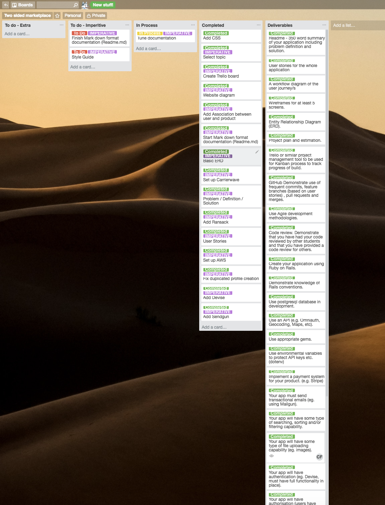

# Hiscore

 

Completed as a major assessment in [Coder Academy's](https://coderacademy.edu.au/) Fast Track Bootcamp.

 

View live: https://hiscore-games.herokuapp.com/

Gitgub link: https://github.com/ChristopherForrest/HiscoreGames

### Table of contents

* [Problem Definition and Solution](#problem-definition-and-solution)
  * [Problem](#problem)
    * [Why is there a need for selling and retro games when you can buy them digitally?](#why-is-there-a-need-for-selling-and-retro-games-when-you-can-buy-them-digitally)
    * [Why Online?](#why-an-online-marketplace)
    * [Why Within Australia?](#why-within-australia)
    * [What is wrong with the sites that already exist?](#what-is-wrong-with-the-sites-that-already-exist)
  * [Solution](#solution)
* [User stories](#user-stories)
  * [Preliminary user stories.](#user-stories)
  * [Detailed user stories](#detailed-user-stories)
* [Workflow](#workflow)
* [Style guide](#style-guide)
* [Wireframes](#wireframes)
* [ERD](#erd)
* [Trello](#trello)
* [The Future](#the-future)
* [Additional Links](#additional_links) 

## Problem Definition and Solution
---
Problem
The sites that sell retro games tend to buy the products from customers at a low and unfair price and resell it at a high price.
This statement is justified by answering the following questions:

* Why is there a need for selling and retro games when you can buy them digitally?
* Why online?
* Why within Australia
* What's wrong with the sites that already exist?

## Why is there a need for selling and retro games when you can buy them digitally?

While in most cases whether a game is on disk or a digital copy there is a growing trend to move our favourite titles onto the digital market which not only allows them to come at a lower cost but also embed them eternally into your library of purchased games where no one can “borrow them” and never return it, saves space in your closet and protects them from the wear and tear of time.

So why buy used, old games on physical copies that have wear and tear? 
Because retro games are **collectable** and often extremely **valuable**.
Here are some examples of some valuable retro games collectors search high and low for:

### Pokemon Red & Blue

**Platform:** Game Boy **Released:** 1998 **Potential Sealed Price:** $550 **Potential Used/Worn Price:** $50

### Super Mario Bros.

**Platform:** NES **Released:** 1985 **Potential Sealed Price:** $25,000 **Potential Used/Worn Price:** $200

Unlike games released today these games have been discontinued and increase in value over time.

## Why an online marketplace?

With Physical stores becoming a thing of the past and online shopping becoming the norm it is becoming more and more important to have a place where customers can easily access your products on their devices regardless of time or location. Online shopping is all about convenience with the ability to have a storefront unattended which intern saves money on wages and gives the ability to have a store up and running 7 days a week 365 days a year.

## Why Within Australia?

Australia’s online retail market is also growing at a rapid rate with more sales being completed online vs in-store purchase every year.
The vintage game market is primarily based in the US which means for every purchase made on a website where they warehouse their goods in America an expensive shipping cost is added which can defeat the purpose of obtaining a game for a cheap price if the cost of the shipping is as much as the amount you are saving. By targeting Australia we are able to show all listings of products within Australia without having to filter through where each game is from and calculating shipping cost.
 Another factor is game region as some games are region specific meaning a game that may work in SEA( South East Asia) or the Americas may not necessarily work in Oceania.

 ## What is wrong with the sites that already exist?

Sites that currently sell vintage video games often resell the products which they buy from the users for a large profit margin meaning a lot of the money that could be passed onto the consumer is eaten up by the provider of the service. 
By creating a marketplace where users can freely buy and sell vintage video games we have cut out the “Man in the middle” allowing 100% of the margin to the customer for increased customer satisfaction and user activity.

 # User Stories

 > As a seller I would like to add detailed information about the games I am selling which allows the users to easily find the games which they are interested in.

 > As a buyer I would like to easily browse listings based on a certain category e.g “genre"

 > As a user I would like a forum where people using the site can discuss certain games and have general discussions.

 > As a user I would like to be able to delete my account and all it’s information if I feel I will discontinue to use the service.

 > As a user I would like to be able to login without having to remember the login details each time I login.

 > As a buyer and seller I would like to be able to see the amount of purchase made since the launch of the website on the main page.

 > As a buyer and a seller I would like to be able to buy and sell games easily without creating an account for buying and selling.

 > As a seller I would like the option for the customer to be able to pick up the game to avoid the trouble of figuring out postage

 > As a buyer I would like the option to pick up the game to avoid costs of postage and complications with addresses

 > As a buyer I would like to pre-fill my delivery information so that I do not need to fill out an address form every time I make a purchase.
 
 > As a buyer I would like to browse all listings without signing up for an account and sharing my personal details.

 > As a user I would like to be able to befriend other users and message them easily and have a message history.

 > As a seller I would like a profile that displays all games listed for sale regardless of genre to allow me to share my profile link and advertise my sales.

 > As a buyer I would like a link to share my purchase with social media so that I may display to my friends a deal or bargain that I may have picked up.

 > As a seller I would like to see my sale history so that I may track my sales to customers to ensure I can offer support to my customers regarding transportation ect.

 > As a buyer I would like to see my purchase history so that I may track my purchases and manage my finances accordingly.

 > As a buyer I want to receive potential offers/deals on titles of a similar genre or creator via email.

 > As a buyer I want to be able to see information about the game such as price, condition, description and an image of the game.

 > As a seller I want to be able to display the title of the game as well as show its price, condition, an image of the game.

 > As a buyer of vintage video games, I want to be able to see the title, price and a short description of the game before visiting the total post.

 > As someone buying vintage video games, I want to be able to send messages to sellers to question them about the product.

 > As someone selling vintage video games, I want to be able to receive messages from customers that may have questions about he products I am selling.

 > As someone buying vintage video games, I want to be able to list items based on which console from which they belong to.

 >  As someone who buys a lot of vintage video games, I want somewhere to buy vintage video games cheaply, so that I can save money.

> As someone who plays a lot of vintage video games, I want an easy way to find games that are otherwise difficult to find via other methods.

> As someone who has collected a lot of vintage games I want to sell, I want to be able to sell my books for a reasonable price without large amounts of profit going to the reseller.

## Detailed user stories
---

***User should be able to view all listings***

**Feature:** View listings

- As a user
- I want to view all listings.
- Because I’m not sure I want to sign up for this website yet.

**Scenario:** User visits website
- Even if not user.
- When I visit the home page of the website.
- And I select a platform or “category” of games.
- I should be able to browse all available games.

***User shouldn’t be able to edit/delete posts that aren’t theirs.***

**Feature:**  Unable to edit/delete listings that aren’t theirs. 

- As a seller
- I want nobody to be able to edit/delete my listings
- Because I always want legitimate information on my listings

**Scenario:** User tries to delete/edit a profile that is not theirs

- Given I am a user.
- I am unable to see the edit/delete function for a post that is not mine.
- So that I am unable to complete those actions on posts that are not mine.

***Logged in user should be able to edit/delete posts that are theirs.***

**Feature:** Able to edit/delete listings that are theirs.

- As a logged in user
- I want to be able to edit/update/delete my listings
- Because I want to keep my listings current with accurate and up to date information.

**Scenario:** Logged in user goes to edit their listing.

- As a logged in user
- When I view my listings on my profile page
- And I change one of the fields of that listing
- And I select update listing
- Then I should be redirected to the updated overview of that listing

***User should be able to view all posts even if not logged in.***

**Feature:**  User should be able to view all listings regardless of being logged in or not. 

- As a user
- I want to be able to view all listings
- Whether or not I am logged in or not

**Scenario:** Signed up user visits website in incognito

- Signed up user visits website in incognito mode (Chrome) or on another device that has never logged in.
- Website doesn’t receive token for login history.
-User is still able to list all available listings while logged out of their account.

***User should be able to filter out listings by category***

**Feature:**  User should be able to use filter to find games of interest easily.

- As a user 
- I want to be able to easily view listings
- filtered by genre

**Scenario:** User wants to view all listings belonging to certain genre

- User visits landing page
- User is then able to select games by console
- User then is able to filter the results by genre

***Logged in user should be able to view all of their listings for sale.***

**Feature:** Able to view all listing for sale

- As a logged in user 
- I want to be able to view all my listings for sale
- With the ability to chose which of my created listings are visible.

**Scenario:** User wants to view all listing they have for sale

- Logged in user view their profile.
- User is then able to view their listings which they have for sale.
- User is also able to choose whether that listing is visible on the market or not.

***Logged in user should be able to view their purchase history.***

**Feature:** Able to see purchase history.

- As a logged in user
- I want to be able to see all purchases I have made over time
- So that I can manage my finances

**Scenario:** User wishes to see purchase history.

- Logged in user visits their profile.
- User is able to see all purchases made.
- User is also able to see details on each sale such as cost,description title ect.

***User should be able to share listings via social media.***

**Feature:** Able to share listings via social media

- As a user.
- I want to be able to copy a link into my clipboard.
- So that I can share it on social media.

**Scenario:** User wishes to share listing on social media

- User visits landing page.
- User selects platform which the game is on.
- User may then select a game from a long list or filter by genre.
- User selects game which in the description contains a embed link.
- User posts on social media.

***Users receive offers and promotions via email***

**Feature:** User receives offers and promotions via email.

- As a signed up user that has provided an email address.
- I want to receive notification of deal and offers.
- So that I may save money.

**Scenario:** User receives promotion via email

- User receives email notification.
- Within email contains daily offer/promotions.
- User clicks on a link which directs them to offer.

***Users are able to add other users as “friends" or “contacts”***

**Feature:** Users can add each other for future contact

- As a signed up user.
- I want to be able to add contacts of my choice.
- So that we can stay connected.

**Scenario:** User adds a friend.

- User shares similar interests with someone on forum
- I want to be able to add that user
- So that I can contact them in future 
“# Hiscore.com”

## Workflow

---

The original workflow was conceptualised in the diagram below.

## Style Guide

---

Colors and fonts were chosen as below:

Open Sans was designed with an upright stress, open forms and a neutral, yet friendly appearance. It was optimised for print, web, and mobile interfaces, and has excellent legibility characteristics in its letterforms.

## Wireframes

---

Content first mockups were created using Figma and can be view [here](https://www.figma.com/file/FrH94nlBAHQMxdGoR9u2sWfg/Untitled)

## ERD

--- 

The original ERD:

Refactored ERD:

## Trello

Trello was used from the beginning of this project to track ideas and tasks, as well as completion dates.

A snapshot at its final moments below:

---

## The Future
---
I intend to make the website more responsive across all devices/platforms aswell as implementing new features and refactoring those that had already been implemented.

## Aditional Links

---

Link to Wireframes: ??? (Is this not Figma?)
 
Link to Flowchart: https://drive.google.com/file/d/1GT2ZHgSSqdwhifpPeJ9SUQPaPHt7jjIr/view?usp=sharing

Link to Figma Mockups: https://www.figma.com/file/FrH94nlBAHQMxdGoR9u2sWfg/Untitled

Link to ERD: https://www.dbdesigner.net/designer/schema/167590